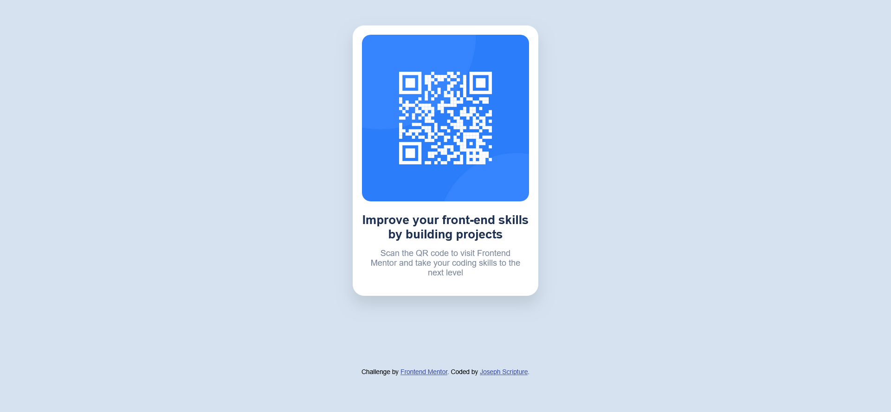

# Frontend Mentor - QR code component solution

This is a solution to the [QR code component challenge on Frontend Mentor](https://www.frontendmentor.io/challenges/qr-code-component-iux_sIO_H). Frontend Mentor challenges help you improve your coding skills by building realistic projects. 

## Table of contents

- [Overview](#overview)
  - [Screenshot](#screenshot)
- [My process](#my-process)
  - [Built with](#built-with)
  - [What I learned](#what-i-learned)
- [Author](#author)

**Note: Delete this note and update the table of contents based on what sections you keep.**

## Overview
This project was to build a qr code scanner.

### Screenshot

**Note: Delete this note and the paragraphs above when you add your screenshot. If you prefer not to add a screenshot, feel free to remove this entire section.**

### Links

- Solution URL: [Add solution URL here](https://your-solution-url.com)
- Live Site URL: [Add live site URL here](https://your-live-site-url.com)

## My process
- started by laying out the html document to ease styling with css. 

### Built with

- Semantic HTML5 markup
- CSS custom properties
- CSS Grid

### What I learned

- I learned to use Css grid for styling, learnt how to use chrome dev tools.

- Frontend Mentor - [@Joseph Scripture](https://www.frontendmentor.io/profile/JosephScripture)
- Twitter - [@Joescript237](https://www.twitter.com/yourusername)

